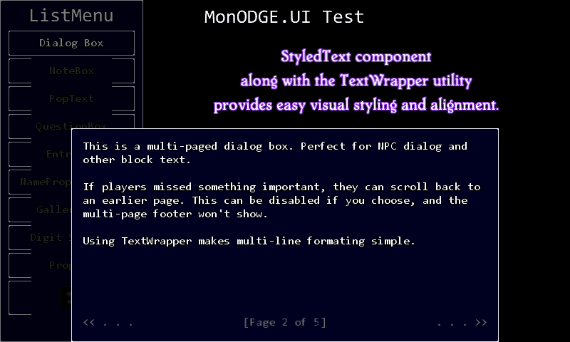
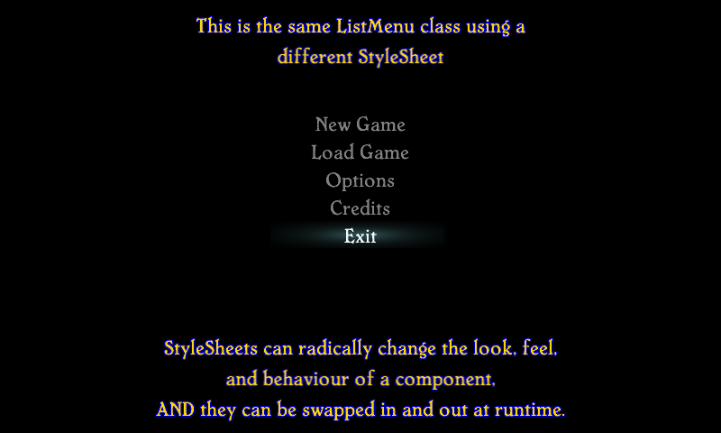

# MonODGE.UI
A stylesheet-based, event-driven player interface library for 2D MonoGame projects.

**Dependencies**: MonoGame 3.8 or higher, MonODGE.IO.

---

#### Features

- Written from the ground up for use with old-school, 2D games. 
MonODGE.UI was developed with classic turn-based RPGs in mind, but can be used for any genre.
- CSS-like Stylesheet based visuals.
Customize your game's look and feel to fit your style, and even change it on the fly!
- Event-driven functionality.
- Extensible. Create or modify custom OdgeComponents to suit your game.

#### Components

- StyleSheet - A dependency of every OdgeComponent, StyleSheets define components' visual presentation and layout, including color, background and border textures, text styles, and much more. 
- StyledText - A formatted text component that uses a StyleSheet to automate layout and presentation, alignment, text shadowing, and more.
- ProgressBar - Also good for health bars!
- Controls
  - DialogBox - A multi-page text display box for game messages and character dialog.
  - DigitSpinner - A ranged numeric input.
  - EntryBox - A simple text input with alpha and numeric filters.
  - GalleryMenu - Both an image gallery and a menu!
  - ListMenu - Scrollable option list, for main menus, inventory screens, etc.
  - QuestionBox - A "yes/no" input form with configurable options, similar to a Windows MessageBox.
- Pop-Ups
  - NoteBox - A lightweight text box for short, temporary messages.
  - PopText - A quick flash of moving text. Good for damage numbers, alerts, etc.
- Utilities
  - A TextWrapper class with methods for wrapping, splitting, and trimming multi-line strings.
  - A LayoutHelper, useful for formatting custom, user created OdgeComponents.
  - A [Visitor Pattern](https://en.wikipedia.org/wiki/Visitor_pattern) utility for running operations across OdgeComponents.

---

#### Screenshots

<table align="center">
<tr>

<td>

</td>

<td>

</td>

<td>

</td>

</tr>
</table>
